<!-- # Hotel Booking Demand Prediction -->

<!-- #### Task 3 Proposal

This is our project for Hanyang Fall 2020 AI class. This Project is not connected to any SE-project.

We want to use historical hotel booking data to predict demand for specific week days. This could help hotel owners price their rooms for maximized ocupancy and increase their revenues. This effort is ment to help the hard hit hotel industry in times of corona.

We hope to find out more about the booking behaviour of costumers throughout the year. In additon, we'd like to create some graphs about the general occupancy of hotels by weekday.

We would like to achive this using random forest. Noone of us has ever used random forrest before but we hope to gian some experience and understanding in the process of this project. -->

#### Members:

Name | Department | University | Email
---- | ---------- | ---------- | -----
Nicolas Arnedo | Department of Computer Science | Hanyang University | nicolasarnedo99@gmail.com
Ashish Saha | Department of Information Systems | Hanyang University | ashish.saha@concordia.ca
Kenneth Plum Toft | Department of Computer Science | Hanyang University | wowkenneth@gmail.com
Ivo Maag | Department of Computer Science | Hanyang University | maagivo1@students.zhaw.ch

## I. Introduction

#### Motivation
We want to use historical hotel booking data to predict demand for specific week days. This could help hotel owners price their rooms for maximized ocupancy and increase their revenues. This effort is meant to help the hard hit hotel industry in times of COVID19.

By the end, we hope to find out more about the booking behaviour of customers throughout the year. In additon, we'd like to create some graphs about the general occupancy of hotels by weekday.

## II. Dataset

#### Contents
The [Kaggle Dataset](https://www.kaggle.com/jessemostipak/hotel-booking-demand) we used is made up of bookings made in one city hotel and resort hotel for stays set for between July 1, 2015 and August 31, 2017. 

All personal identifying information were removed from the dataset, and it consists of the following data columns:

* __Hotel__
  * Hotel type (H1 = Resort Hotel or H2 = City Hotel)
* __Cancellation Status__
  * Value indicating if the booking was canceled (1) or not (0)
* __Lead Time__
  * Number of days that elapsed between the entering date of the booking into the PMS and the arrival date
* __Arrival Date Year__
  * Year of arrival date
* __Arrival Date Month__
  * Month of arrival date
* __Arrival Date Week Number__
  * Week number of year for arrival date
* __Arrival Date Day of Month__
  * Day of arrival date
* __Stays in Weekend Nights__
  * Number of weekend nights (Saturday or Sunday) the guest stayed or booked to stay at the hotel
* __Stays in Week Nights__
  * Number of week nights (Monday to Friday) the guest stayed or booked to stay at the hotel
* __Adults__
  * Number of adults in booking
* __Children__
  * Number of children in booking
* __Babies__
  * Number of babies in booking
* __Meal__
  * Type of meal booked. Categories are presented in standard hospitality meal packages: 
    * Undefined/SC – no meal package
    * BB – Bed & Breakfast
    * HB – Half board (breakfast and one other meal – usually dinner)
    * FB – Full board (breakfast, lunch and dinner)
* __Country__
  * Country of origin represented in the ISO 3155–3:2013 format
* __Market Segment__
  * Market segment designation. The terms:
    * “TA” means “Travel Agents”
    * “TO” means “Tour Operators”
* __Distribution Channel__
  * Booking distribution channel. The terms:
    * “TA” means “Travel Agents”
    * “TO” means “Tour Operators”
* __Repeating Guest__
  * Value indicating if the booking name was from a repeated guest (1) or not (0)
* __Previous Cancellations__
  * Number of previous bookings that were cancelled by the customer prior to the current booking
* __Previous Bookings Not Cancelled__
  * Number of previous bookings not cancelled by the customer prior to the current booking
* __Reserved Room Type__
  * Code of room type reserved. Code is presented instead of designation for anonymity reasons.
* __Assigned Room Type__
  * Code for the type of room assigned to the booking. Sometimes the assigned room type differs from the reserved room type due to hotel operation reasons (e.g. overbooking) or by customer request. Code is presented instead of designation for anonymity reasons.
* __Booking Changes__
  * Number of changes/amendments made to the booking from the moment the booking was entered on the PMS until the moment of check-in or cancellation
* __Deposit Type__
  * Indication on if the customer made a deposit to guarantee the booking. This variable can assume three categories:
    * No Deposit – no deposit was made
    * Non Refund – a deposit was made in the value of the total stay cost
    * Refundable – a deposit was made with a value under the total cost of stay
* __Agent__
  * ID of the travel agency that made the booking
* __Company__
  * ID of the company/entity that made the booking or responsible for paying the booking. ID is presented instead of designation for anonymity reasons
* __Days in Waiting List__
  * Number of days the booking was in the waiting list before it was confirmed to the customer
* __Customer Type__
  * Type of booking, assuming one of four categories:
    * Contract - when the booking has an allotment or other type of contract associated to it
    * Group – when the booking is associated to a group
    * Transient – when the booking is not part of a group or contract, and is not associated to other transient booking
    * Transient-party – when the booking is transient, but is associated to at least other transient booking
* __Average Daily Rate__
  * Average Daily Rate as defined by dividing the sum of all lodging transactions by the total number of staying nights
* __Required Car Parking Spaces__
  * Number of car parking spaces required by the customer
* __Total of Special Requests__
  * Number of special requests made by the customer (e.g. twin bed or high floor)
* __Reservation Status__
  * Reservation last status, assuming one of three categories:
    * Canceled – booking was canceled by the customer
    * Check-Out – customer has checked in but already departed
    * No-Show – customer did not check-in and did inform the hotel of the reason why
* __Reservation Status Date__
  * Date at which the last status was set. This variable can be used in conjunction with the ReservationStatus to understand when was the booking canceled or when did the customer checked-out of the hotel

#### Data Cleaning
To begin with, as we are making a hotel booking demand algorithm, it doesn't make sense to take into account entries in our dataset where the booking was canceled. These bookings will make our prediction algorithm less accurate, that is why we have decided to eliminate all the entries in which is_canceled is true:

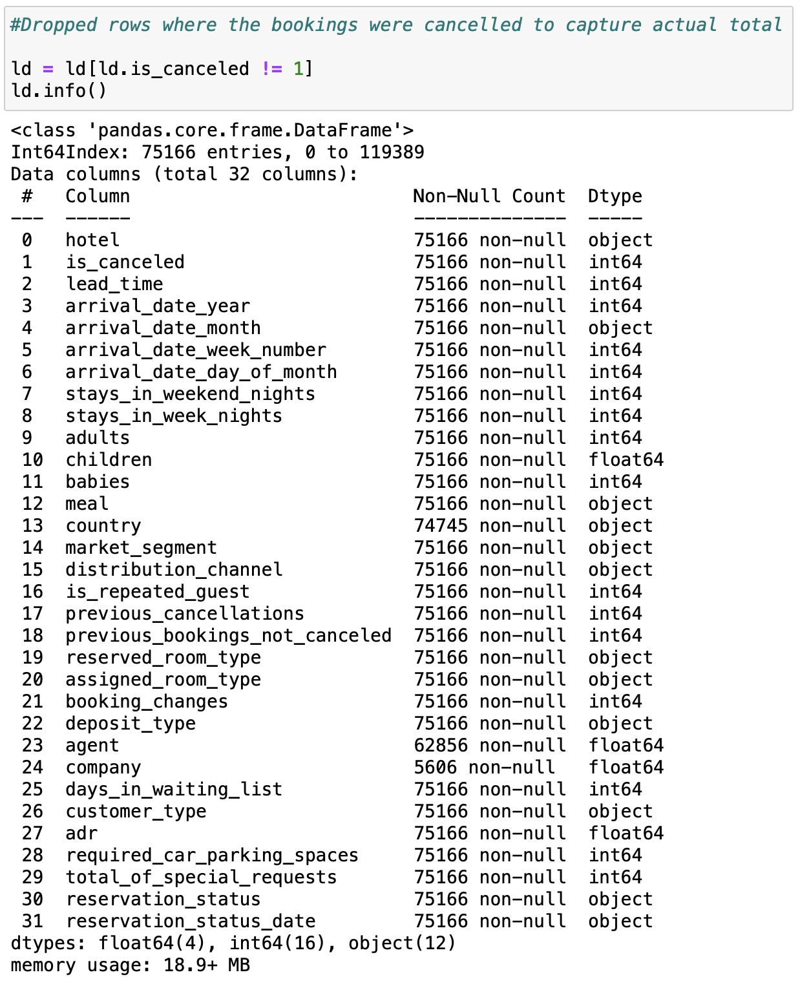

This makes a significant change in the amount of entries we now have for the rest of the columns. We went from 119389 to 75166. Now that we made this "strategical" decision, we can take a look at the rest of the data in our csv file. We will start by looking at the number of NaN values:

These values we want to take care of first before we can start further analysing our data. 
We see that the country, company and agent columns have NaN values. To get more accurate results, we are going to analyze what the missing data most likely would be, and if we are unable to find a fitting value, we list them as unknown. All of this will help us getting more accurate results without errors.

First we take a look at the country column:

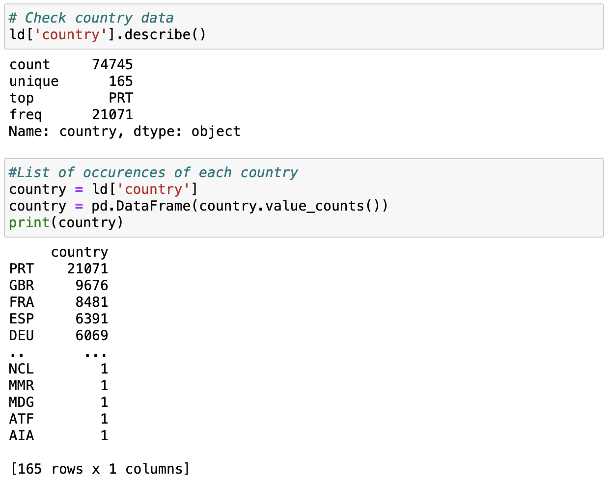{ width=50% }

Here we see that most of the hotel bookings are from Portugal, but we cannot find a correlation of the NaN data lines and what country they could belong to. So, we are going to fill the values with "unknown".

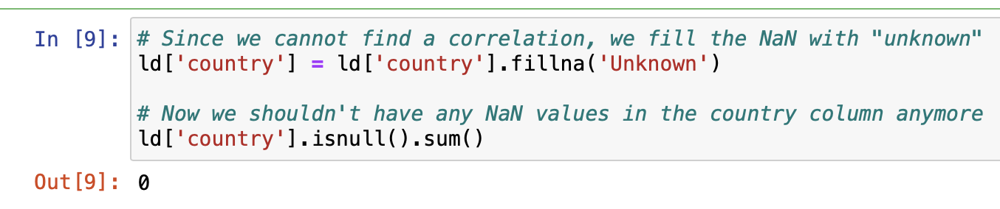

After cleaning this column, these are the results:

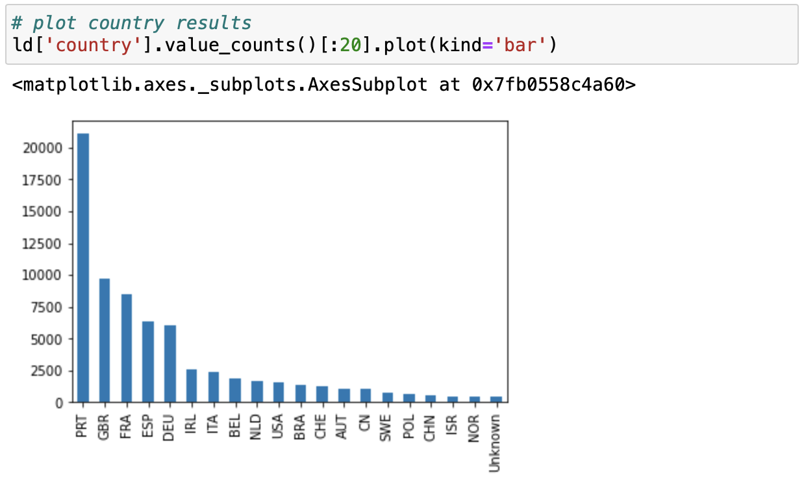

Then we moved on to the company column and see what it contains to analyze it:

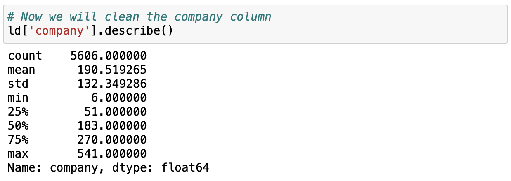

We realize that the count for the company column is 5606, this is a very small number as we know that each column has 75166 entries.

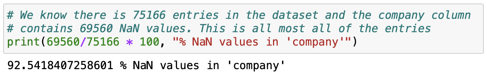

With a 92% of the entries being NaN values we decided it was best to drop this column as it will not help to create a correlation with such a high percentage of NaN's.

Next, let's look at the "agent" column:

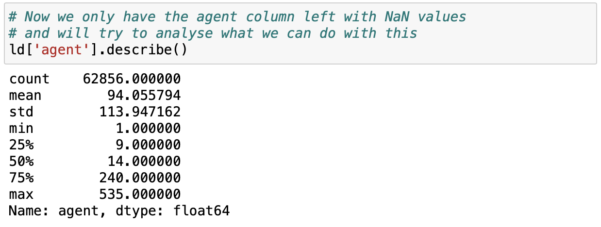

The agent column contains the number of the agent's that made the booking. The number of agent represents the different type of agent that help made a booking.

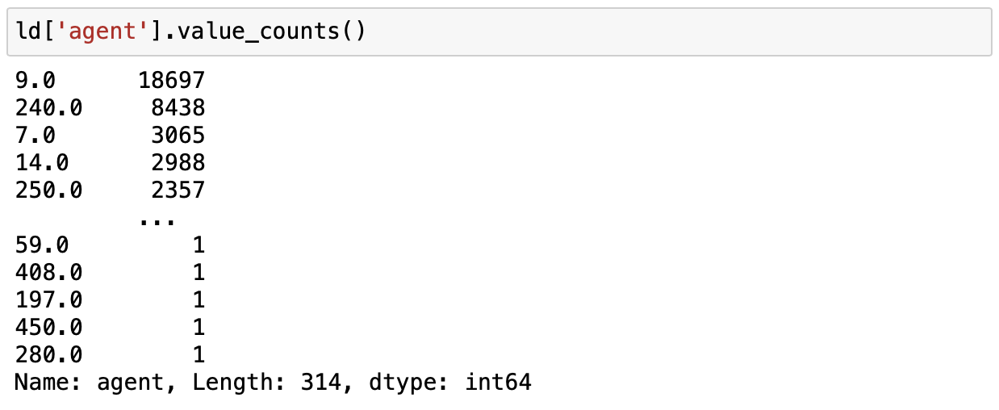

Since not every booking is made by an agent there are many NaN values. We decided to change tha NaN values to 0, so no information gets lost while removing the NaN values.

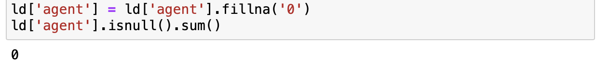

Now we finished cleaning our dataset and it is now ready for use.

## III. Methodology

#### Algorithm choices:

TODO: Add Prediction

#### Feature and code explanations:

## IV. Evaluation & Analysis

#### Data Analysis

Later we want to predict the total number of people that book hotel rooms. In the dataset the data is split into "adults", "children" and "babies". So, before we move on we need to add them together.

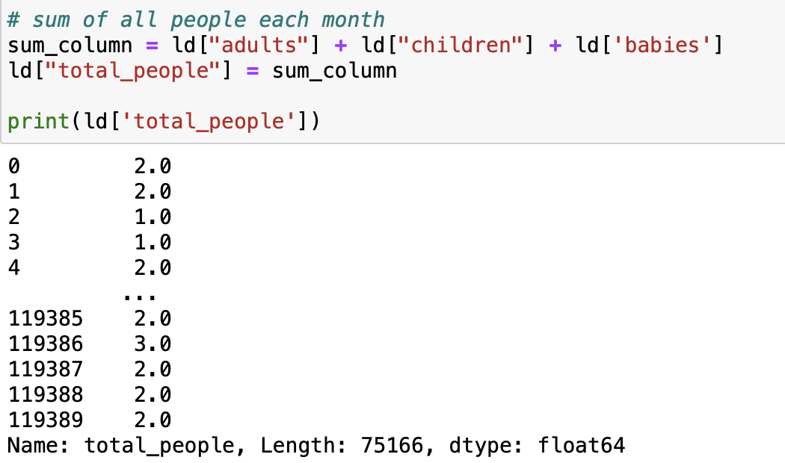

Now we can visualize the number of hotel bookings throughout the year in the following pretty graphs.

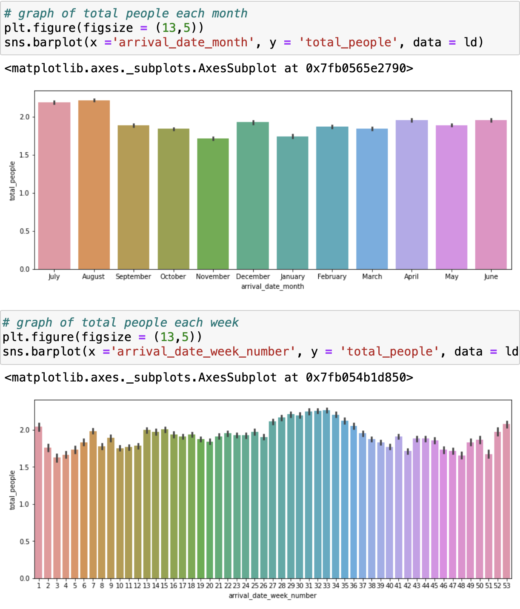

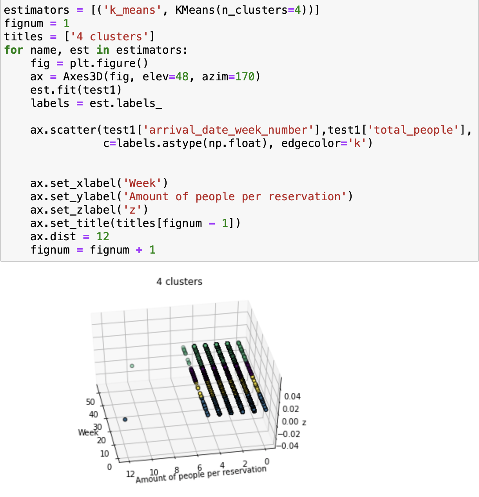

#### Random Forest
After cleaning the dataset, we wanted to find out which features have the strongest correaltion to the total amount of people which is our target. This graph display graphically how much the different features correlate with each other. The lower the number, the stronger the correlation (displayed in blue). The higher the number, the weaker the correlation (displayed in red).

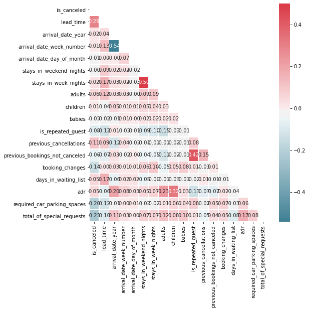

This is the average number of guests with each booking for each week during a full year. In general the bookings are quite stable all through the year, but we can see spikes around new year and during the summer. Our goal is to predict the amount of guests expected per booking in a specific week.

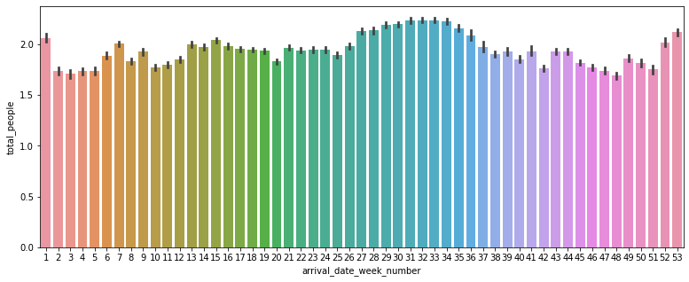

<!-- ## Task 4 -->
## V. Related Work
[Hanyang gym crowdedness](https://www.kaggle.com/benvae/hanyang-gym-crowdedness)

[Training with Weights: Machine Learning at the Gym:](https://medium.com/@nicksrose72/training-with-weights-machine-learning-at-the-gym-356c643b402f)

[Using Machine Learning to Predict Bus Ticket Sales](https://heartbeat.fritz.ai/predicting-bus-ticket-sales-using-machine-learning-dd2fcfe15392?gi=b264624991a)

<!-- ### Tools / Software / Services -->
- Python
- [Kaggle Dataset](https://www.kaggle.com/jessemostipak/hotel-booking-demand)
- Jupyter

## VI. Conclusion

